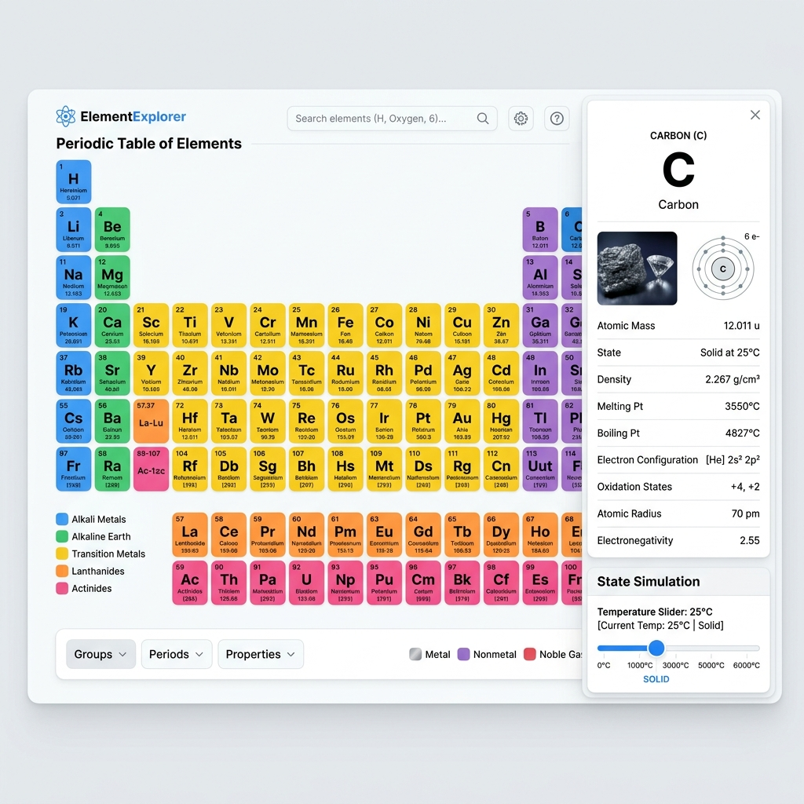

# 🧪 ElementExplorer

ElementExplorer is a digital, interactive Periodic Table designed for chemistry students. Built using React.js and Tailwind CSS v4, this web application simplifies the visualization of complex chemical data and provides an engaging, educational experience.



---

## ✨ Key Features

### 1. 📊 Interactive Periodic Table
- Interactive 18-column grid containing all 118 chemical elements.
- Elements are color-coded by group/category (Alkali metals, Halogens, Noble gases, Transition metals, etc.) with cohesive pastels.
- Click any element to slide open a detailed chemical profile card showing its atomic weight, electron configuration, boiling/melting points, density, electronegativity, shell counts, and a brief description.

### 2. 🌡️ Temperature Simulator
- Heat or cool the periodic table from **0 K to 6000 K** using an interactive slider.
- Observe physical state changes (Solid, Liquid, Gas) in real time across the elements.
- Quick temperature presets including *Absolute Zero (0 K)*, *Liquid Nitrogen (77 K)*, *Room Temperature (298 K)*, *Water Boiling (373 K)*, *Iron Melting (1811 K)*, and the *Sun's Surface (5778 K)*.

### 3. ⚖️ Compare Mode
- Select any two elements to compare their physical parameters side-by-side.
- Compares atomic weight, density, electronegativity, boiling point, and melting point.
- Uses dynamic relative ratio bars to visually indicate which element is denser, heavier, or has higher thermal thresholds.

### 4. ⚗️ Reactions Lab
- Simulate reactions between elements and common reactants: **Water ($H_2O$)**, **Oxygen ($O_2$)**, and **Acid ($HCl$)**.
- Displays the balanced chemical equations, reactivity speeds (None, Slow, Moderate, Vigorous, Explosive), and detailed observations.
- Provides explanation callouts summarizing periodic group trends.

### 5. 🔍 Real-Life Uses
- A searchable database showcasing daily applications of various chemical elements.
- Details the **scientific reasoning** behind why an element's specific physical or chemical properties make it suitable for its use (e.g. Helium's low boiling point for MRI, Titanium's biocompatibility for surgical implants, Gold's oxidation resistance for electronic connectors).

### 6. 🏆 Chemistry Quiz Game
- Test your knowledge with dynamically generated chemical questions.
- Includes matching symbols to names, matching names to symbols, identifying atomic numbers, and placing elements in their correct chemical categories.
- Tracks score, streak counters, and provides educational explanation summaries.

---

## 🛠️ Technology Stack

- **Frontend**: React.js (Vite)
- **Styling**: Tailwind CSS v4 (configured via `@tailwindcss/vite` plugin)
- **Icons**: Lucide React
- **Data Source**: Bowserinator's structured Periodic Table JSON dataset

---

## 🚀 Getting Started

### Prerequisites
- Node.js (v18 or higher recommended)
- npm or yarn

### Installation

1. Clone the repository:
   ```bash
   git clone https://github.com/your-username/element-explorer.git
   cd element-explorer
   ```

2. Install dependencies:
   ```bash
   npm install
   ```

3. Run the development server:
   ```bash
   npm run dev
   ```
   Open your browser and navigate to `http://localhost:5173/`

### Building for Production
To bundle the application into optimized, production-ready static assets:
```bash
npm run build
```
The output will be generated inside the `dist/` directory.
